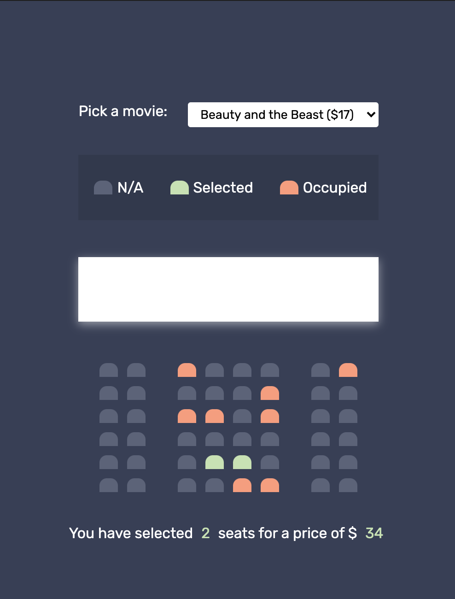

# Movie-Seat-Booking

1. User can select movies.
2. User can select seats.
3. Count the number of selected seats and calculate the total price.
4. Use local storage to store data (selected movie and seats).

